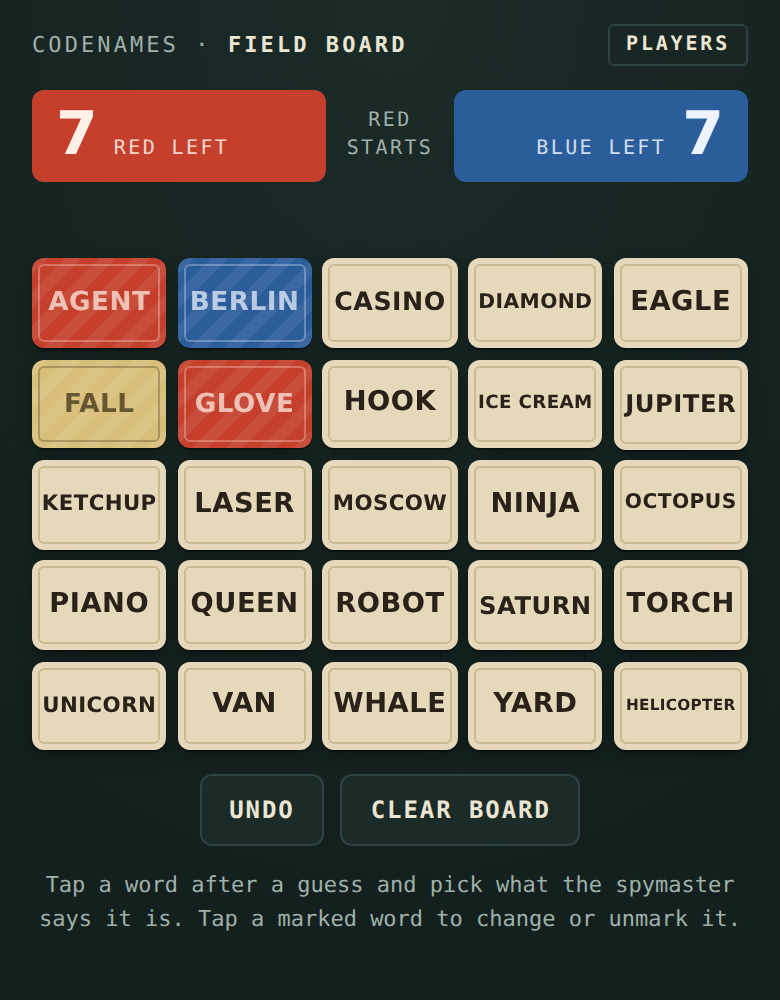
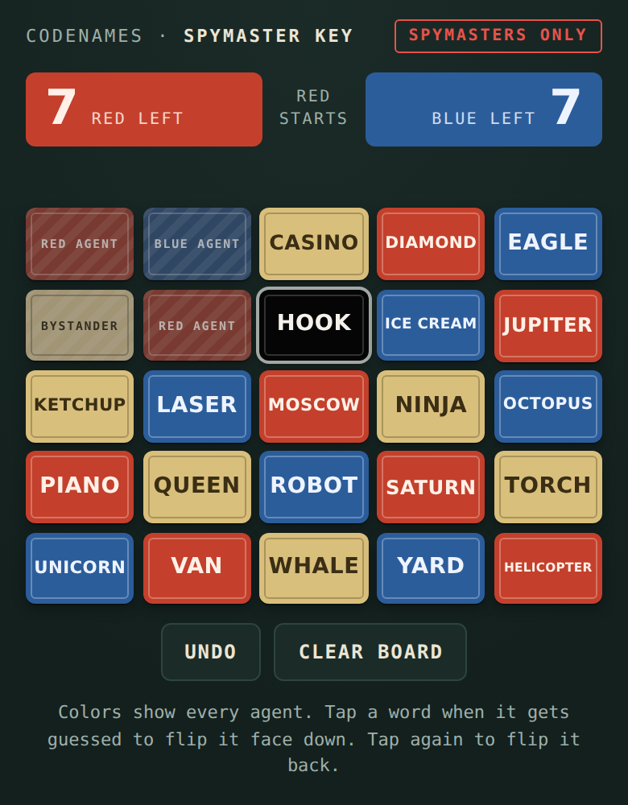

# Games

## Codenames phone boards

An AI agent skill for playing Codenames on phones when the table is blocked, the group is too big, or some players are remote.

Give your agent two photos: the 5x5 word board and the spymasters' key card. It makes two interactive pages:

| Players' board | Spymasters' board |
|---|---|
|  |  |
| Every word sits on a plain card. After a guess, tap the word and mark it red, blue, bystander or assassin. The assassin ends the game. | Every word shows its key color. Tap a guessed word to flip it face down, and its color stays. |

- The players' page never contains the key.
- Works with any language edition, including Hebrew and other right-to-left ones.
- Only the host needs an AI agent. Everyone else opens a link or an HTML file in their phone's browser.

### Install

**[Download codenames-board.zip](https://github.com/sronkar/Games/raw/main/dist/codenames-board.zip)**

- **Claude (claude.ai, desktop or mobile app):** in Settings → Capabilities, turn on code execution, then upload the zip under Skills. Do this from a computer or the website, and the skill then works on your phone too.
- **Claude Code:** unzip into `~/.claude/skills/`, so you have `~/.claude/skills/codenames-board/SKILL.md`.
- **Other agents:** unzip it and point the agent at `codenames-board/SKILL.md`. The build script needs Python 3 and no packages.

### Play

1. Take a photo of the board and a photo of the key card, from the same side of the table.
2. Send both to your agent and ask it to set up a Codenames game.
3. Send the players' board to everyone and the spymasters' board only to the two spymasters. On claude.ai, turn on a public link in each page's Share menu so people without Claude can open it.

Each phone keeps its own marks and the boards don't sync. One person marks the players' board and shows it to the table or shares their screen on the call.

### Try it without photos

```bash
python3 skills/codenames-board/scripts/build_boards.py skills/codenames-board/examples/game.json --out out
```

Then open `out/public.html` and `out/spymaster.html` in a browser.

The skill's source is in [`skills/codenames-board`](skills/codenames-board). After changing it, rebuild the download with `cd skills && zip -r ../dist/codenames-board.zip codenames-board`.
